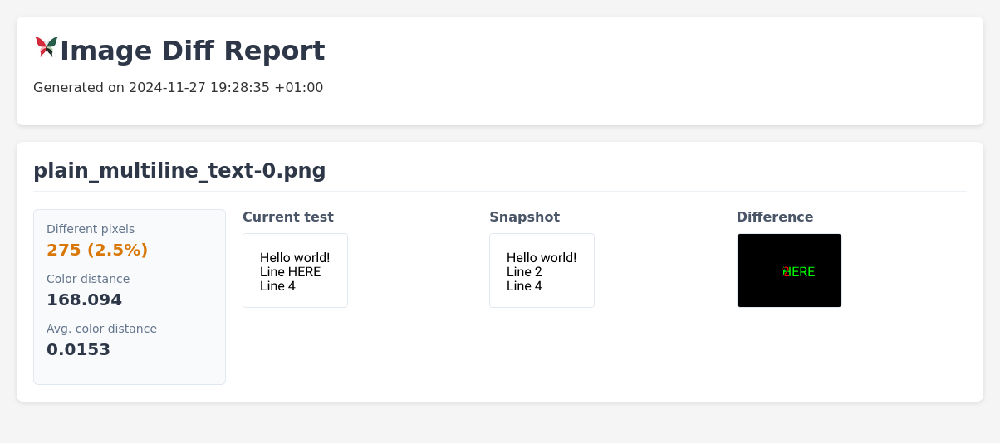

<p align="center">

</p>

# Image Diff Review

*Image diff review* is a tool for reporting image differences. It is intended for use in snapshot testing.
It can be used as a stand-alone CLI tool or as a Rust crate.




## CLI

### Installation

```commandline
$ cargo install image_diff_review --features=cli
```

### Usage

```commandline
$ image_diff_review <left/image_dir> <right/image_dir> report
```